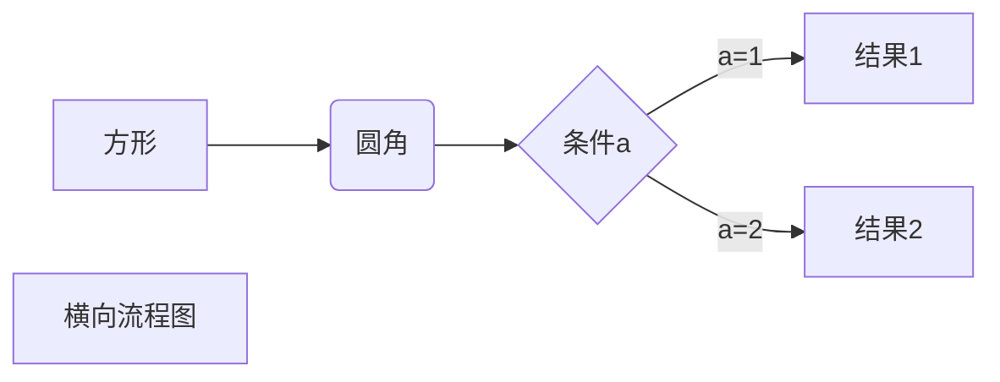
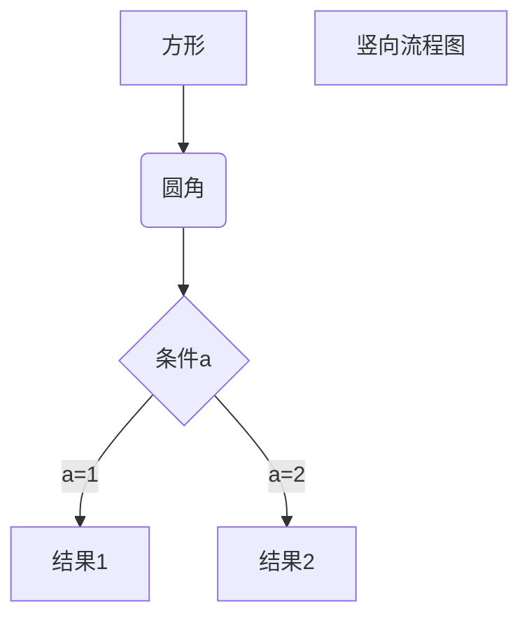
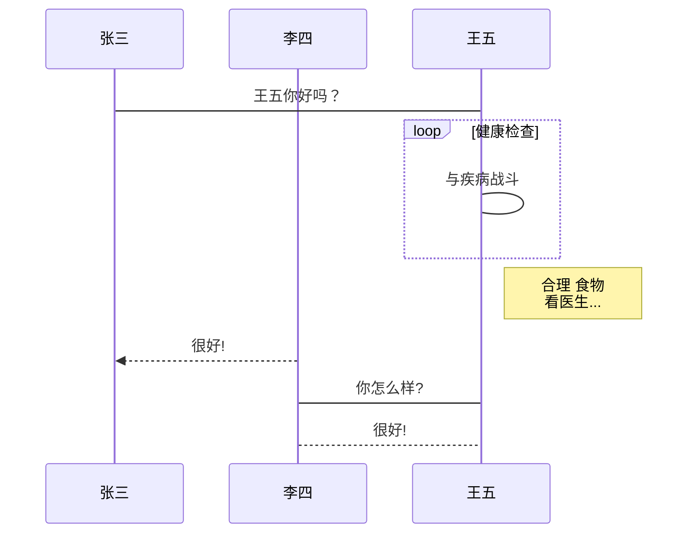

展示一级标题
=================

展示二级标题
-----------------

# 一级标题

## 二级标题
### 三级标题
#### 四级标题
##### 五级标题
###### 六级标题
---
我要换行  

我要换行

---

*斜体*
_斜体_
**加粗**
__加粗__
***粗斜体***
___粗斜体___
~~删除线~~
<u>下划线</u>

---
分隔符
***
---
* * *
- - -
___
_ _ _

创建脚注[^foot]
[^foot]: 我是脚注（前面有个空格）

---

* 第一项
* 第二项
+ 第一项
+ 第二项
- 第一项
- 第二项
1. 第一项
2. 第二项
---
列表嵌套
1. 第一项
    - 嵌套1（前面有四个空格）
    - 嵌套2
2. 第二项
    - 嵌套1（前面有tab）
    - 嵌套2
---
>区块引用
>>区块嵌套
>1. 区块列表1
>2. 区块列表2
---
1. 列表区块
    >前面有四个空格
2. 列表区块
    >前面有tab
---
行代码
`println()`

代码区块（前面用空格或tab，且要空1行）
    
    int i=1;
    i++;

代码区块（指定或不指定语言）
```java
int i=0;
i++;
```

---
互联网链接测试[百度](https://www.baidu.com)
文件链接测试[文档绝对路径](C:/文档路径)
文件链接测试[文档相对路径](文档路径)
高级链接[百度][1],下面要空一行

[1]: http://www.baidu.com

---


或者用普通html标签，可指定大小


---
表格
左对齐|居中对齐|右对齐
:-|:-:|-:
1|1|1
2|2|2

左对齐|居中对齐|右对齐
:----|:-----:|-----:
1|1|1
2|2|2

---
支持的HTML标签
使用 <kbd>Ctrl</kbd>+<kbd>Alt</kbd>+<kbd>Del</kbd> 重启电脑

---
转义
\*\*显示星号\*\*

---
公式
$$
\mathbf{V}_1 \times \mathbf{V}_2
$$

---
1、横向流程图

2、竖向流程图

3、标准流程图
```flow
st=>start: 开始框
op=>operation: 处理框
cond=>condition: 判断框(是或否?)
sub1=>subroutine: 子流程
io=>inputoutput: 输入输出框
e=>end: 结束框
st->op->cond
cond(yes)->io->e
cond(no)->sub1(right)->op
```
4、标准流程图（横向）
```flow
st=>start: 开始框
op=>operation: 处理框
cond=>condition: 判断框(是或否?)
sub1=>subroutine: 子流程
io=>inputoutput: 输入输出框
e=>end: 结束框
st(right)->op(right)->cond
cond(yes)->io(bottom)->e
cond(no)->sub1(right)->op
```
5、UML时序图
```sequence
对象A->对象B: 对象B你好吗?（请求）
Note right of 对象B: 对象B的描述
Note left of 对象A: 对象A的描述(提示)
对象B-->对象A: 我很好(响应)
对象A->对象B: 你真的好吗？
```
6、UML时序图复杂
```sequence
Title: 标题：复杂使用
对象A->对象B: 对象B你好吗?（请求）
Note right of 对象B: 对象B的描述
Note left of 对象A: 对象A的描述(提示)
对象B-->对象A: 我很好(响应)
对象B->小三: 你好吗
小三-->>对象A: 对象B找我了
对象A->对象B: 你真的好吗？
Note over 小三,对象B: 我们是朋友
participant C
Note right of C: 没人陪我玩
```
7、UML标准时序图

8、甘特图
